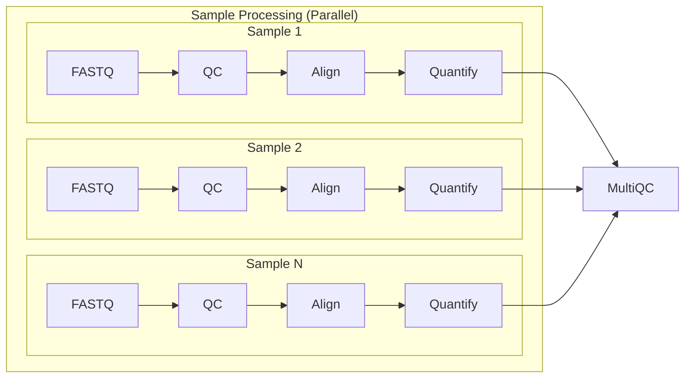

# Basic RNASeq pipeline using Nextflow and AWS Batch

## Pipeline workflow:


## References
Before running the pipeline, you need to download reference and annotation files. 
I have included a script (download_references.sh) to download necessary reference and annotation files. For explanation on how to run the script, please run the following command:
```Bash 
chmod +x download_references.sh
./download_references.sh 
```
*Note*:
All the references are from AWS iGenomes S3 bucket.
- s3://ngi-igenomes/igenomes/Homo_sapiens/UCSC/hg38 for Human
- s3://ngi-igenomes/igenomes/Mus_musculus/UCSC/mm10 for Mouse

