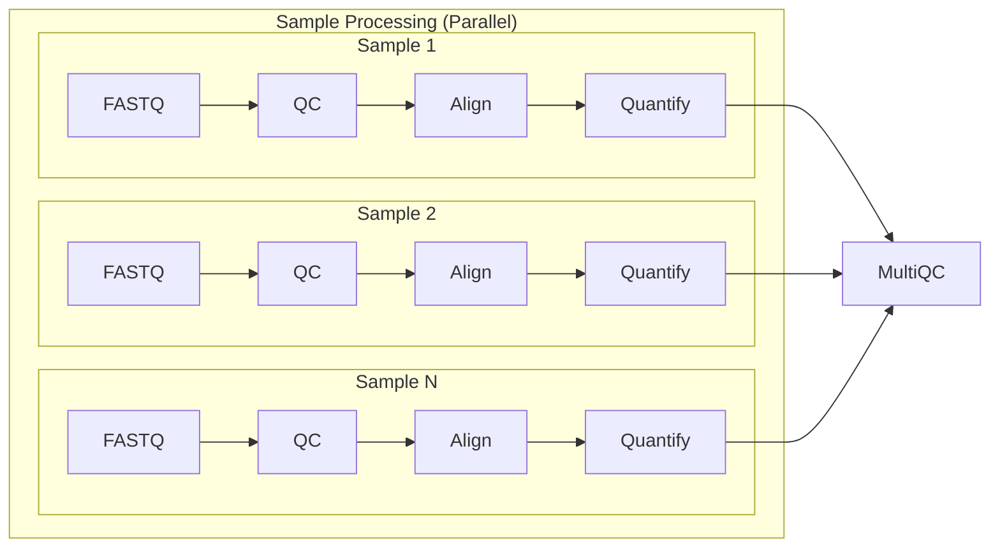

# Basic RNASeq pipeline using Nextflow and AWS Batch

## Pipeline workflow:


## Docker Image build
It is recommended to run this pipeline with Docker for consistency.

<u>Steps</u>:
- Navigate to the repo root directory.
- Build docker image (make sure Dockerfile is in the current directory).
```Bash
docker build -t rnaseq_nextflow:latest .
```

## AWS Batch Configuration
1. Create a Batch Environment (Fargate should be sufficient and convenient for this workflow). Set max vCPU to 256 or larger depending on how many samples you are planning on running.
2. Create a Job Queue by attaching Compute Environment to the Job Queue. Select Fargate again. 
3. (Optional) Set up Job definition for larger storage size for each batch job. This will require setting up creating "Execution role" with AmazonECSTaskExecutionRolePolicy attached.

## AWS ECR Configuration
*Note*: Make sure you have built the docker image already before proceeding.

<u>Steps</u>:
- Go to AWS Console -> Find ECR -> Create a repo
- Note down the repo URI. This should look something like this: 
```
123456789012.dkr.ecr.us-east-1.amazonaws.com/my-docker-image
# 123456789012 - This should be your own unique ID
# us-east-1 - Make sure this is the correct region
```
- Log in to ECR using Docker command:
```
aws ecr get-login-password --region us-east-1 | \
docker login --username AWS --password-stdin 123456789012.dkr.ecr.us-east-1.amazonaws.com
```
- Tag your docker image
```
docker tag myimage:latest 123456789012.dkr.ecr.us-east-1.amazonaws.com/my-docker-image:latest
```
- Push image to ECR
```
docker push 123456789012.dkr.ecr.us-east-1.amazonaws.com/my-docker-image:latest
```

## References
Before running the pipeline, you need to download reference and annotation files. 
I have included a script (download_references.sh) to download necessary reference and annotation files. For explanation on how to run the script, please run the following command:
```Bash 
chmod +x download_references.sh
./download_references.sh 
```
*Note*:
All the references are from AWS iGenomes S3 bucket.
- s3://ngi-igenomes/igenomes/Homo_sapiens/UCSC/hg38 for Human
- s3://ngi-igenomes/igenomes/Mus_musculus/UCSC/mm10 for Mouse

## How to run
